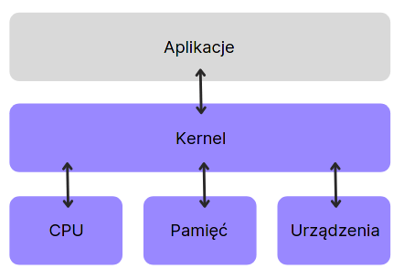
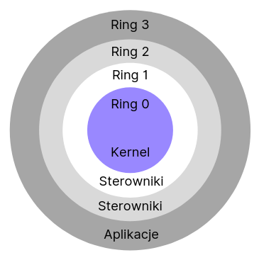

Systemy operacjne, Uniwersytet Jagielloński 2021

Magdalena Lipka

# Moduły jądra systemu linux

## Czym są kernel modules?

Moduły jądra systemu są dodatkowym kodem, rozszerzającym kernel o dodatkowe sterowniki i API dla użytkownika.

Mogą być ładowane do jądra na żądanie w każdym momencie. Bez nich dodanie każdej nowehj funkcjonalności wymagałoby ponownej kompilacji kernela i rebootowania systemu.

Podczass bootowania systemu, initrd lub initramfs ładuje moduły znajdujące się w /etc/modules (/etc/modules.conf na Archu). Podczas działania systemu kernel wykrywa brakujące moduły np. po podłączweniu nowego urządzenia i je doładowuje.



## Kernel mode vs user mode

Programy uruchomione w kernel mode mają większe uprawnieni niż te uruchamiane w user mode. W user mode ograniczony jest dostęp do pamięci - aplikacje domyślnie mają dostęp tylko do własnej pamięci, podczas gdy kod uruchomiony w kernel mode współdzieli pamięć. Moduły kernela mają też bezpośredni dostęp do hardware'u, często udostępniając API dla aplikacji użytkownika, które ma ograniczony dostęp do urządzeń i niektórych instrukcji procesora.



## Operacje

- wyświetlanie obecnie załadowanych modułów

```bash
lsmod
```

- ładowanie modułu

```bash
insmod hello.ko
```

- usuwanie modułu

```bash
rmmod hello.ko
```

## Hello world

```c
#include <linux/module.h>
#include <linux/kernel.h>

static int hello ( void ) {
    printk(KERN_INFO "Hello world.\n");
    return 0;
}
static void goodbye ( void ) {
    printk(KERN_INFO "Goodbye world.\n");
}

module_init(hello);
module_exit(goodbye);
```

_Logi z `printk` można zobaczyć zapomocą `dmesg`._
Dodanie urządzenia: `mknod /dev/messenger_server c 235 0`

## Kompilacja

```
obj−m += hello.o

all:
	make −C /lib/modules/$(shell uname −r)/build M=$(PWD) modules

clean:
	make −C /lib/modules/$(shell uname −r)/build M=$(PWD) clean
```
